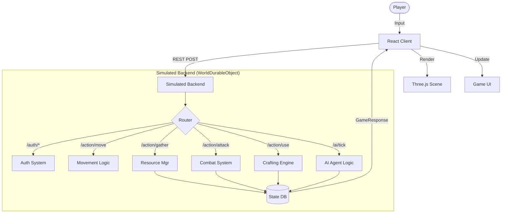

# RSC Evolution AI

> A "Zero to Hero" RuneScape Classic style MMORPG prototype driven by a simulated AI backend and procedural evolution.

## 🗺️ Project Overview

**RSC Evolution AI** allows players to start as a primitive "Sub-Human" in a Stone Age environment and evolve through history by leveling skills, crafting tools, and unlocking new Eras.

-   **Frontend**: React 19, Three.js (@react-three/fiber), Tailwind CSS.
-   **Backend**: Simulated In-Memory Server (Mocking Cloudflare Workers + Durable Objects).
-   **Style**: Retro Low-Poly (RuneScape Classic / PS1 aesthetic).
-   **Core Mechanic**: Evolution. Skills and Quests unlock visual upgrades and new gameplay mechanics.

---

## 👑 Administration & Security

Access to developer tools and world-altering commands is strictly restricted to the Owner account.

-   **Owner Account**: `Pick Of Gods`
-   **Capabilities**:
    -   Force Evolution
    -   Spawn Resources/Gold
    -   Reset Character State
    -   Heal/Restore Vitals

---

## 🧠 AI & NPC Behavior

The world is populated by autonomous agents:

1.  **Companion ("Gronk")**: A persistent follower that aids the player. It will dynamically follow you through the world.
2.  **Mobs (Rats, Bandits)**: Aggressive NPCs that detect the player within range and pursue them.
3.  **Civilians (Merchants, Guides)**: Passive NPCs that wander the local area and offer services.

---

## 🔄 System Architecture

The game follows a Client-Server model (simulated locally for this prototype). The Client renders the state, and the Backend handles logic, validation, and database updates.

---

## ✅ Progress Tracker

### Core Systems
- [x] **Game Loop**: Ticking system, simulated network latency.
- [x] **Authentication**: Login, Registration, GPS "Biometric" Scan.
- [x] **Persistence**: LocalStorage saving of Player/AI state.
- [x] **Sound Engine**: Browser-based Synth for retro SFX (Chop, Mine, Level Up).
- [x] **Character Creator**: Paper-doll style customization (Hair, Clothes, Colors).
- [x] **Global Lobby**: Holographic Globe scene showing player location.

### Gameplay Mechanics
- [x] **Movement**: Click-to-move with pathfinding approximation.
- [x] **Camera**: Orbit controls with Zoom/Rotate.
- [x] **Inventory**: 28-slot grid, Drag & Drop (Partial), Context Menus.
- [x] **Equipment**: Full slot system (Head, Body, Legs, Hands, Feet, Weapon, Shield, Rings).
- [x] **Stats**: 18 Skills (Attack, Defense, Woodcutting, etc.) with XP tables.
- [x] **Shop System**: Buy/Sell interface with NPC Merchants.

### Evolution & Quests (Tutorial Island)
- [x] **Stage 0: Scavenge**: Pickup Sticks/Stones.
- [x] **Stage 1: Tool Making**: Craft Hatchet (Stone + Stick).
- [x] **Stage 2: Weaponry**: Craft Spear (Hatchet + Stick).
- [x] **Stage 3: Combat**: Kill Giant Rat.
- [x] **Quest Reward**: "Quest Complete" Scroll Popup & Loot (Bone Shaft + Rathide Set).
- [x] **Stage 4: Upgrade**: Craft Bone Spear.
- [x] **Stage 5: Firemaking**: Rub sticks together.
- [x] **Stage 6: Cooking**: Cook Rat Meat.
- [x] **Stage 7: Mining**: Mine Copper (Era 1 Transition).

### Upcoming / To-Do
- [ ] **Banking System**: Deposit/Withdraw items.
- [ ] **Trading**: Player-to-Player trade window.
- [ ] **Multiplayer**: Real WebSockets for seeing other players move.
- [ ] **Era 2 (Magic)**: Ancient Altar functionality and spellcasting.
- [ ] **AI LLM**: Real integration with Gemini/Llama for NPC dialogue.

---

## 🔌 API Endpoints (Simulated)

All requests are POST to the internal `backend` object.

| Endpoint | Payload | Description |
| :--- | :--- | :--- |
| `/auth/login` | `{username, pass}` | Authenticates user against mock DB. |
| `/auth/register` | `{username, pass, apiKey}` | Creates new user. Key used for future AI. |
| `/auth/gps` | `{lat}` | Initializes world seed based on location. |
| `/action/move` | `{x, z}` | Updates player position. |
| `/action/gather` | `{targetId, type}` | Woodcutting, Mining, etc. |
| `/action/attack` | `{targetId}` | Calculates hit, deals damage, handles loot. |
| `/action/use` | `{itemId, targetId, targetType}` | **Core Crafting**. Logic for Item-on-Item or Item-on-Object. |
| `/action/equip` | `{itemId}` | Moves item from Inv -> Equipment slot. |
| `/action/eat` | `{itemId}` | Consumes food for HP. |
| `/action/shop` | `{action, itemId}` | BUY or SELL items. |
| `/action/talk` | `{npcId}` | Triggers dialogue or opens Shop. |
| `/admin/action` | `{action}` | **OWNER ONLY**: Cheats & Dev Tools. |

---

## 📜 Crafting Recipes (Stone Age)

1. **Stone Hatchet**: Use `Sharp Stone` -> `Branch`
2. **Stone Spear**: Use `Stone Hatchet` -> `Branch`
3. **Bone Spear**: Use `Bone Shaft` -> `Stone Spear`
4. **Fire**: Use `Branch` -> `Logs` (Ground/Inventory)
5. **Cooked Meat**: Use `Raw Meat` -> `Fire`
6. **Shortbow**: Use `Sharp Stone` -> `Logs`

---

## 🎨 Art Direction

- **Visuals**: Procedural Geometry generated in React Three Fiber. No external assets.
- **UI**: CSS Tailwind styled to look like 2001-era RPG interfaces (Brown/Beige/Orange).
- **Sound**: `SpeechSynthesis` API for NPC voices + `AudioContext` Oscillators for SFX.
